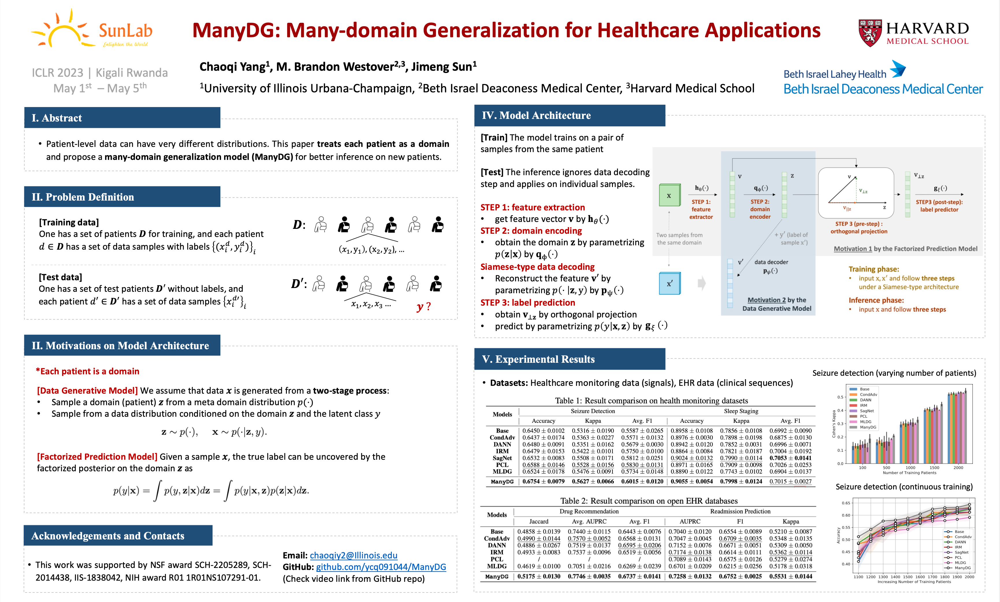

# ICLR'23 ManyDG Paper
- ManyDG: Many-domain Generalization for Healthcare Applications
- Data, Processing Scripts, Baselines and Model Codes
> 15-minute explanation video is provided in [YouTube]
https://www.youtube.com/watch?v=xKOSiauQtwc



## 1. Folder Tree
- ```data/```
    - ```drugrec/```
        - this is the folder stores data for drug recommendation task
        - **data_process.py**: this file is used for processing MIMIC-III data for the task
        - before running the scripts, please refer to https://physionet.org/content/mimiciii/1.4/ for downloading the latest version of MIMIC data
        - refer to https://github.com/sjy1203/GAMENet and https://github.com/ycq091044/SafeDrug for trouble shooting
    - ```Seizure/```
    - ```sleep/```
        - this is the data folder for the processed sample-based Sleep-EDF cassette portion.
        - **sleep_edf_process.py**: the processing file for sleep-edf (using multiprocess package for parallel programming)
        - for downloading the Sleep-EDF data, please refere to https://www.physionet.org/content/sleep-edfx/1.0.0/
    - ```hospitalization/```
        - this is the folder for the processed eICU data
        - **eICU_process_step1.py**: the first processing step of eICU data
        - **eICU_process_step2.py**: the second processing step of eICU data
        - for downloading eICU data, please refer to https://eicu-crd.mit.edu/
    - ```idxFile/```
        - this folder stores the code mapping of different event types in eICU dataset. They will be generated from **eICU_process_step1.py** and **eICU_process_step2.py**. They are used to assign feature dimensions for hospitalization prediction task
- ```log/```, ```pre-trained/```
    - this two folders stores the automatically generated running logs and pre-trained models
- **model.py**
    - this file contains all the backbone and Base models for running the experiments
- ```run_drugrec/```
    - **model_drugrec.py**: This file inherit the Base model and other model utility functions from **model.py** and support the drug recommendaton task
    - **run_drugrec.py**: This is the entry of drug recommendation task, specifiying the data loader and other initialization steps.
    - **utils_drugrec.py**: This file provides the data split and loading files.
- ```run_hospitalization/```
    - **model_hospitalization.py**: This file inherit the Base model and other model utility functions from **model.py** and support the hospitalization prediction task
    - **run_hospitalization.py**: This is the entry of hospitalization prediction task, specifiying the data loader and other initialization steps.
    - **utils_hospitalization.py**: This file provides the data split and loading files.
- ```run_seizure/```
    - **model_seizure.py**: This file inherit the Base model and other model utility functions from **model.py** and support the seizure detection task
    - **run_seizure.py**: This is the entry of seizure detection task, specifiying the data loader and other initialization steps.
    - **utils_seizure.py**: This file provides the data split and loading files.
- ```run_sleep/```
    - **model_sleep.py**: This file inherit the Base model and other model utility functions from **model.py** and support the sleep staging task
    - **run_sleep.py**: This is the entry of sleep stagin task, specifiying the data loader and other initialization steps.
    - **utils_sleep.py**: This file provides the data split and loading files.

## 2. How to run the code
- for seizure detection
``` python
cd ./ManyDG
# obtain the Seizure data first
python run_seizure/run_seizure.py --model [MODEL] --cuda [WHICH GPU] --N_vote [DEFAULT 5] --N_pat [N_OF_PAT] --epochs [EPOCHS]
```
- for sleep staging
``` python
cd ./ManyDG
python data/sleep/sleep_edf_process.py
python run_sleep/run_sleep.py --model [MODEL] --cuda [WHICH GPU] --N_pat [N_OF_PAT] --epochs [EPOCHS]
```
- for drug recommendation
``` python
cd ./ManyDG
python data/drugrec/data_processing.py
python run_drugrec/run_drugrec.py --model [MODEL] --cuda [WHICH GPU] --N_pat [N_OF_PAT] --epochs [EPOCHS]
```
- for hospitalization prediction
``` python
cd ./ManyDG
python eICU_process_step1.py
python eICU_process_step2.py
python run_hospitalization/run_hospitalization.py --model [MODEL] --cuda [WHICH GPU] --N_pat [N_OF_PAT] --epochs [EPOCHS]
```

## 3. Citation
```bibtex
@inproceedings{yang2023manydg,
    title = {ManyDG: Many-domain Generalization for Healthcare Applications},
    author = {Yang, Chaoqi and Westover, M. Brandon and Sun, Jimeng},
    booktitle = {The 11th International Conference on Learning Representations, {ICLR} 2023},
    year = {2023}
}
```